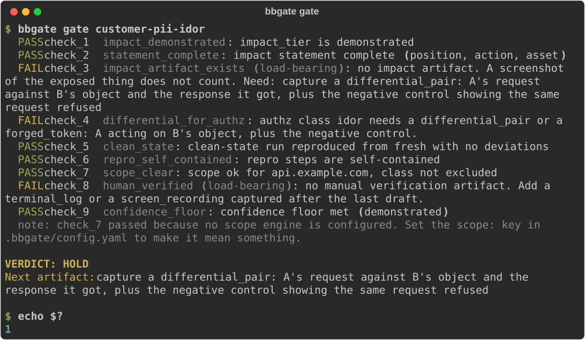
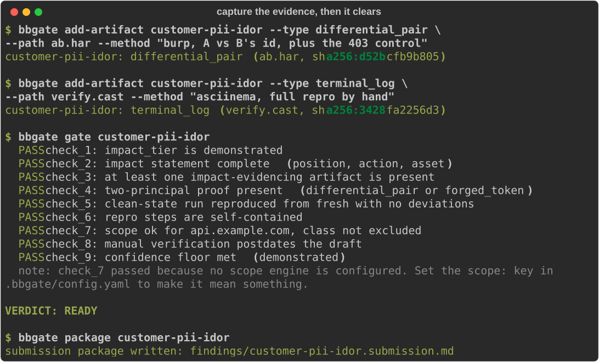
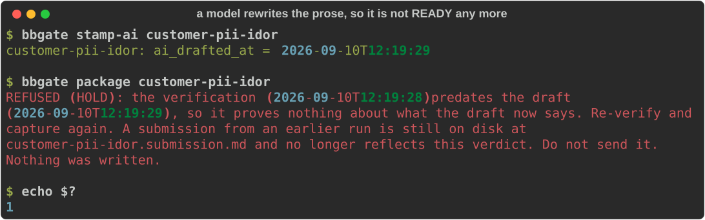
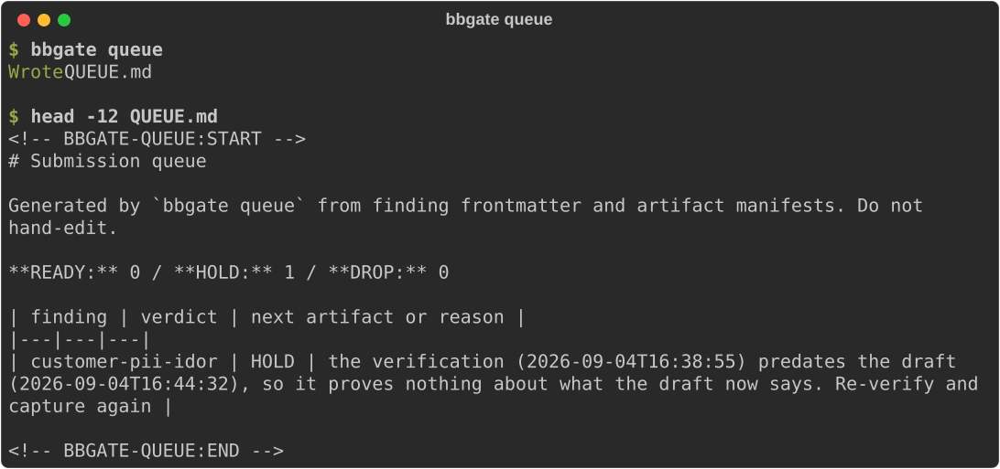

# bbgate

A pre-submission gate for bug bounty findings. It reads a finding you wrote and
the evidence files you captured beside it, then answers one question: is there
anything on disk that shows the consequence you are claiming? If there is not,
it will not write a submission.

It is not anti-model. It assumes you draft with one, and it is built for that.
What it will not accept is a writeup that has moved on since the last time a
person re-ran the thing by hand, and it settles that by comparing two
timestamps rather than asking whether you checked.
[Using it with a model](#using-it-with-a-model) is the loop.



The finding above looks finished. It claims demonstrated impact and it has a
clean-state run. It holds because nothing captured shows the consequence, and
because nobody has re-run it by hand since the writeup was last drafted.

## Install

Not on any package index. Install from a checkout:

```
git clone https://github.com/sonnycroco/bbgate
cd bbgate
pip install .
```

## How it works

A finding is a markdown file with YAML frontmatter: the class, the host, the
program, the impact you are claiming, and the repro steps. Beside it sits an
`artifacts/` directory with a `manifest.tsv`, one row per piece of evidence,
recording its type, path, hash and when it was captured.

`bbgate gate` runs nine checks over those two things and prints READY, HOLD or
DROP. `bbgate package` writes the submission, but only on READY. Nothing else
writes one.

The verdict is never stored. It is recomputed from the files every time you
ask, so capturing one more artifact changes the answer.

## Walking the example to READY

`bbgate init --example` drops in the finding above. It is missing two things,
and the HOLD says which. Go and capture them:



Now let a language model tidy the prose, the way a drafting step would:



A finding that was READY is not READY any more. What made it trustworthy was a
person re-running it, and that happened before the current text existed.

`bbgate queue` writes the same verdicts out as a committable list of what you
owe:



## Using it with a model

The risk here is drafting that outruns the last time a person checked anything,
not the drafting. So the loop that keeps working:

1. Do the testing and capture the artifacts yourself. A model cannot produce a
   `differential_pair`. That comes from you making the request and recording
   what came back.
2. Let a model draft or tidy the writeup.
3. Stamp it with `bbgate stamp-ai <finding>`, which records `ai_drafted_at`.
4. Re-run the repro by hand and capture a `terminal_log` or `screen_recording`.
5. Gate it.

Skip step 4 and check_8 fails, so the finding holds no matter how good the prose
got. That is the whole mechanism. It costs nothing when you are working
honestly, and it stops a writeup nobody has re-checked since a model rewrote it
from reaching a triager.

Step 3 is on your honour, and it is the one place the tool takes your word for
something. If you never stamp, check_8 has nothing to compare against and fails
anyway, so the lazy path is still a held finding rather than a false pass.

### Driving it from an agent

`bbgate gate <finding> --json` gives an agent everything it needs to work the
finding without being able to argue with the result:

```json
{"finding": "customer-pii-idor",
 "verdict": "HOLD",
 "failed": ["check_3", "check_4", "check_8"],
 "next_artifact": "capture a differential_pair: A's request against B's object ...",
 "hold_reason": "..."}
```

Trimmed for space: the full object also carries `checks`, every check with its
own `passed` and `reason`, plus `drop_reason` when the verdict is DROP.

Read `next_artifact`, go capture that specific thing, gate again. Exit codes are
`0`, `1` and `2`, so it also works as a plain shell condition. The verdict is
derived from files on every call, which means an agent cannot talk its way to
READY. The only move available to it is capturing something that was not there
before.

One caution that is nothing to do with this tool: think about what you paste
into a model. Findings carry the target's data, and most programs have terms
about where that data goes.

## The nine checks

| id | name | passes when |
|---|---|---|
| check_1 | impact_demonstrated | effective tier is demonstrated |
| check_2 | statement_complete | impact.attacker_position, action and asset all non-empty |
| check_3 | impact_artifact_exists | at least one artifact evidences impact |
| check_4 | differential_for_authz | if class is an authz class, a differential_pair or forged_token exists |
| check_5 | clean_state | a run with from_state=fresh, result=reproduced, deviations=[] |
| check_6 | repro_self_contained | repro non-empty and no pre-existing-state lint hit |
| check_7 | scope_clear | scope ok, class not excluded, not a suspected duplicate |
| check_8 | human_verified | a verification artifact exists and, if `ai_drafted_at` is set, postdates it |
| check_9 | confidence_floor | effective tier is demonstrated |

`check_1`, `check_3`, `check_5` and `check_8` are load bearing: failing one of
those holds the finding on its own. The rest are advisory, and which set is load
bearing is a config key. An unset or unknown `vuln_class` fails a guard ahead of
everything class-dependent, so mislabelling is not a way around check_4.

## Impact tiers

| tier | meaning | routes to |
|---|---|---|
| demonstrated | an artifact shows the consequence | the only tier that reaches READY |
| inferred | believed, artifact missing | HOLD |
| conditional | depends on an unverified precondition | HOLD |
| theoretical | class present, consequence unproven | DROP |

A non-empty `impact.precondition` forces the tier to `conditional` whatever you
declared, since a finding cannot be demonstrated while it names a precondition
nobody verified. If it does hold, verify it and empty the field.

## Artifact types

| type | what it shows |
|---|---|
| `differential_pair` | A acting on B's object, next to the same request being refused |
| `oob_callback` | the request came from the target's infrastructure, not yours |
| `poc_html` | the payload ran on a real origin, with the value it captured present |
| `forged_token` | a credential you minted was accepted for a privileged action |
| `http_exchange` | counts only when the row is flagged `shows_privileged_data` |

`terminal_log` and `screen_recording` are verification artifacts, used by
check_8. They do not evidence impact.

A `screenshot` counts for nothing, which is the part people argue with. It
shows a rendering of a response you already had: no request, no second
principal, no negative control, nothing tying the image to a position you should
not have held. Anyone can screenshot their own account and crop the username
out. If you disagree, `impact_artifact_types` is config and it is your call.

## Configuration

`.bbgate/config.yaml` marks the project root the way `.git` does. Every key is
optional, so a two-line file is valid.

```yaml
findings_dir: findings          # where findings live, severity subdirs optional
queue_path: QUEUE.md            # where `bbgate queue` writes the owed-work list
log_path: .bbgate/gate-log.tsv  # append-only, one row per gate call
classes: ""                     # your own classes.yaml, empty uses the shipped one
rubric: ""                      # your own rubric.yaml, empty uses the shipped one
load_bearing: [check_1, check_3, check_5, check_8]
authz_classes: [idor, bola, bfla, oauth, jwt]
impact_artifact_types: [differential_pair, oob_callback, poc_html, forged_token]
verification_artifact_types: [terminal_log, screen_recording]
scope:
  mode: none                    # none | command
  command: ""                   # e.g. "myscope {host}", prints verdict JSON on stdout
programs:
  example-bbp:
    excludes: [clickjacking]    # classes this program will not pay for, routes to DROP
```

The rubric says what each class looks like when it is only a condition, what
clears it, and which artifact to go and capture. If your programs draw the line
elsewhere, change it. Class slugs are stable identifiers, so renaming one
orphans the findings that reference it.

Scope defaults to permissive: with `mode: none` every host answers ok and the
output says so rather than implying a check happened. To wire in your own, set
`mode: command` with a `{host}` template. The command runs without a shell and
must print JSON:

```json
{"host": "api.example.com", "verdict": "ok", "reasons": ["matched program scope"]}
```

`block` drops the finding, `warn` and `unknown` hold it. A timeout, bad JSON or
a missing binary answers `unknown`, so an engine that broke cannot pass a
finding by failing.

## Exit codes

`0` READY, `1` HOLD, `2` DROP or a usage error. `package` writes nothing and
exits non-zero on anything but READY.

In CI, gate the right set. `gate --all` fails on any HOLD, and most findings in
a working repo are legitimately unfinished, so that build stays red forever and
people learn to ignore it. `gate --all --claimed` gates only findings whose
frontmatter `status` says they are sendable, which turns the build red on a
contradiction instead of on work in progress.

```yaml
- run: pip install .
- run: bbgate gate --all --claimed
```

The case it catches: a finding passes, gets marked ready, then someone runs the
writeup back through a model to tidy it. The verification now predates the
draft, check_8 fails, and the build goes red before anybody sends it.

## Limitations

It trusts your manifest. Record a screenshot as a `differential_pair` and it
believes you; it checks that evidence of a kind was captured, not that the bytes
say what you claim.

The rubric is my judgment about what proof looks like per class, and yours may
land elsewhere. That is why the rubric, the class list and the artifact type
lists are all config.

It never touches a target. No check opens a socket, and the only subprocess it
runs is the scope command you configured. It does not decide severity either;
use your platform's rubric for that.

This is 0.1.0. The check ids and config keys are what I would least like to
change, but they are not frozen.

## Development

```
python3 -m venv .venv
.venv/bin/pip install -e ".[dev]"
.venv/bin/pytest -q
.venv/bin/ruff check src tests
```

## License

MIT. Copyright 2026 Sonny Croco.
